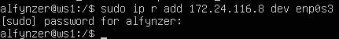
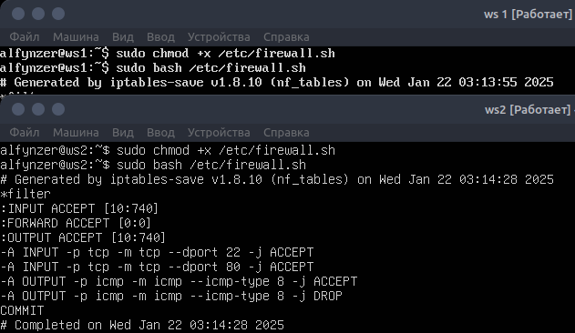
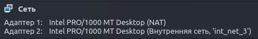
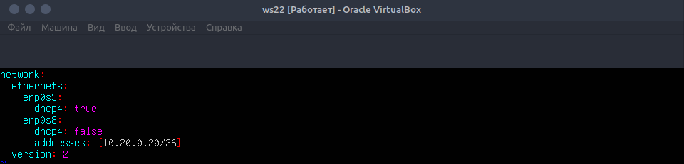
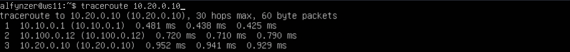
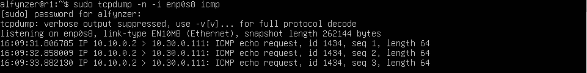
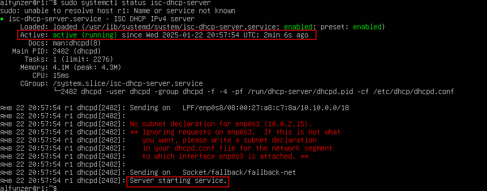
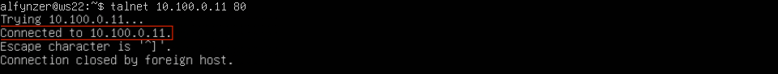

# Part 1. Инструмент ipcalc
- Создаем вертуальную машину ws1 c версией Ubuntu 24.04.1 LTS без графического интерфейса.

* Если у вас не установлен ipcalc, запустите sudo apt install ipcalc

ipcalc — это утилита, которая может выполнять простые манипуляции с адресами IPv4.
## 1.1 Сети и маски
 1. Определяем адрес сети c помощью команды: ipcalc 192.167.38.54/13
 
 

 2. Перевод маски 255.255.255.0 в префиксную и двоичную запись, /15 в обычную и двоичную, 11111111.11111111.11111111.11110000 в обычную и префиксную
 * Перевод маски 255.255.255.0 в префиксную и двоичную запись.
 
 

 * Перевод маски /15 в обычную и двоичную.
 
 

 * Перевод маски 11111111.11111111.11111111.11110000 в обычную и префиксную.
   _ipcalc не переводит из двоичной системы.Переводим в префиксную.
   складываем все "1" (8+8+8+4 = 28)._
   

 3. Минимальный и максимальный хост в сети 12.167.38.4 при масках: /8, 11111111.11111111.00000000.00000000, 255.255.254.0 и /4
 
  
## 1.2. localhost
 1. Определяем можно ли обратиться к приложению, работающему на localhost, со следующими IP: 194.34.23.100, 127.0.0.2, 127.1.0.1, 128.0.0.1
 * 194.34.23.100  - нет
 * 127.0.0.2      - да
 * 127.1.0.1      - да
 * 128.0.0.1      - нет

    
## 1.3. Диапазоны и сегменты сетей
 1.  Какие из перечисленных IP можно использовать в качестве публичного, а какие только в качестве частных: 10.0.0.45, 134.43.0.2, 192.168.4.2, 172.20.250.4, 172.0.2.1, 192.172.0.1, 172.68.0.2, 172.16.255.255, 10.10.10.10, 192.169.168.1
 * к публичным относятся следующие IP адреса: 134.43.0.2, 172.0.2.1, 192.172.0.1, 172.68.0.2, 192.169.168.1
 * к частным относятся следующие IP адреса: 10.0.0.45, 192.168.4.2, 172.20.250.4, 172.16.255.255, 10.10.10.10
 

 2. Какие из перечисленных IP-адресов шлюза возможны у сети 10.10.0.0/18: 10.0.0.1, 10.10.0.2, 10.10.10.10, 10.10.100.1, 10.10.1.255
 * Из предложенных IP-адресов только 10.10.0.2, 10.10.10.10 и 10.10.1.255 являются допустимыми адресами для устройств в сети 10.10.0.0/18.
 
    
# Part 2. Статическая маршрутизация между двумя машинами
## Поднимаем две виртуальные машины ws1 и ws2.

В настройках каждой машины во вкладке Сеть задаем Тип подключения: Внутренняя сеть.

Запускаем обе машины и устанавливаем им соответствующие имена хоста:

* для первой машины
_sudo hostnamectl set-hostname ws1_

* для второй машины
_sudo hostnamectl set-hostname ws2_

## С помощью команды ip a смотрим существующие сетевые интерфейсы
* WS-1

* WS-2

## Описать сетевой интерфейс, соответствующий внутренней сети, на обеих машинах и задай следующие адреса и маски: ws1 — 192.168.100.10, маска /16, ws2 — 172.24.116.8, маска /12.
* Используем следующую команду для открытия файла и установки в нём статического адреса:
 sudo vim /etc/netplan/50-cloud-init.yaml  (_тоже самое что  00-installer-config.yaml_)
 * Этот файл на обеих машинах сначала выглядит одинаково

 

* Дописываем в файлы соответствующие строки.

 ws1

 ws2

## Выполняем команду netplan apply для перезапуска сервиса сети.
* Выполняем для каждой машины

* Проверяем результат

WS-1

WS-2

## 2.1. Добавление статического маршрута вручную
* Добавить статический маршрут от одной машины до другой и обратно при помощи команды вида ip r add:

WS-1

WS-2

* Пропинговать соединение между машинами:

WS-1

WS-2

## 2.2. Добавление статического маршрута с сохранением

* Перезапустим машины, данные не сохранились

* Добавляем статический маршрут от одной машины до другой с помощью файла /etc/netplan/00-installer-config.yaml.

WS-1

WS-2

* Применяем новые настройки с помощью команды
_sudo netplan apply_

* Пропингуем соединение между машинами

WS-1

WS-2

# Part 3. Утилита iperf3
## 3.1 Скорость соединения:
* Перевести и записать в отчёт: 8 Mbps в MB/s, 100 MB/s в Kbps, 1 Gbps в Mbps:8 Mbps = 1 MS/s.
 1. 8 Mbps = 1 MS/s.
 2. 100 MB.s = 100000 Kbps.
 3. 1 Gbps = 1000 Mbps.

* Измерить скорость соединения между ws1 и ws2:

WS-1 server:

WS-2 server

# Part 4. Сетевой экран 
## 4.1. Утилита iptables
* Создаем файл /etc/firewall.sh, имитирующий файрвол, на ws1 и ws2:
 _sudo touch /etc/firewall.sh_
* Добавляем в файл следующие правила согласно задания:
 _sudo vim /etc/firewall.sh

1. На ws1 применить стратегию, когда в начале пишется запрещающее правило, а в конце пишется разрешающее правило (это касается пунктов 4 и 5).

2. На ws2 применить стратегию, когда в начале пишется разрешающее правило, а в конце пишется запрещающее правило (это касается пунктов 4 и 5).

3. Открыть на машинах доступ для порта 22 (ssh) и порта 80 (http).

4. Запретить echo reply (машина не должна «пинговаться», т. е. должна быть блокировка на OUTPUT).

5. Разрешить echo reply (машина должна «пинговаться»).

WS-1

WS-2

* Запусти файлы на обеих машинах командами chmod +x /etc/firewall.sh и /etc/firewall.sh.

_Разница в том, что команды выполняются по порядку. Поэтому в ws1 пинг будет запрещен(потому что разрешение стоит после запрещения), а в ws2 будет разрешен, так как разрешение стоит первее._
## 4.2. Утилита nmap
* Командой ping найти машину, которая не "пингуется", после чего утилитой nmap показать, что хост машины запущен.

WS-1 не пингуется

WS-2 пингуется

* Запускаем утилиту nmap командой (для проверки ищем в выводе nmap наличие строки Host is up)

* Сохранить дампы образов виртуальных машин

 _Вид после создания снимков_

 

 _После сохранения появится новая папка Snapshots._

 

 # Part 5. Статическая маршрутизация сети
 * Создадим сеть, по следующей схеме

 

 1. Поднимаем пять виртуальных машин (3 рабочие станции (ws11, ws21, ws22) и 2 роутера (r1, r2)).
 * Сначала создаём одну виртуальную машину. Потом нажимаем правую клавишу мыши на вновь созданной машине, вибираем Клонировать... и клонируем ещё 4 машины с соответствующими заданию именами (`ws11`, `ws21`, `ws22` и `r1`, `r2`).

 **Задаём следующие настройки виртуальным машинам:**

 * Для машины `Router r1` в Настроить - Сеть выставляем:
 1. Адаптер_1   оставляем как есть (_Тип подключения: NAT_);
 2. Включаем Адаптер_2, выставляем (_Тип подключения: Внутренняя сеть и устанавливаем имя_  `int_net_1`);
 3. Включаем Адаптер_3, выставляем (_Тип подключения: Внутренняя сеть и устанавливаем имя_  `int_net_2`).

 

 Запускаем `r1` и меняем имя хоста на соотвтетствующее:
 `sudo hostnamectl set-hostname r1`
 Перезагружаем машину `r1`.

 * Для машины Router `r2`:
 1. Адаптер_1   оставляем как есть (_Тип подключения: NAT_);
 2. Включаем Адаптер_2, выставляем (_Тип подключения: Внутренняя сеть и устанавливаем имя_  `int_net_2`);
 3. Включаем Адаптер_3, выставляем (_Тип подключения: Внутренняя сеть и устанавливаем имя_  `int_net_3`).
 
 

 Запускаем r2 и меняем имя хоста на соотвтетствующее:
 `sudo hostnamectl set-hostname r2`
 Перезагружаем машину `r2`.

 * Для машины `ws11`:
 1. Адаптер_1 оставляем как есть (_Тип подключения: NAT_);
 2. включаем Адаптер_2, выставляем (_Тип подключения: Внутренняя сеть и устанавливаем имя_  `int_net_1`).

 

 * Для машин `ws21` и `ws22`:
 1. Адаптер_1 оставляем как есть (_Тип подключения: NAT_);
 2. включаем Адаптер_2, выставляем (_Тип подключения: Внутренняя сеть и устанавливаем имя_  `int_net_3`).

 

 Запускаем все ws и меняем на них имя хоста на соотвтетствующее:
 `sudo hostnamectl set-hostname (имя)`

 Перезагружаем машины `ws11`, `ws21` и `ws22`.
## 5.1. Настройка адресов машин
 1. Настроить конфигурации машин в etc/netplan/00-installer-config.yaml согласно сети на рисунке.
 * Проверяем какие интерфейсы есть на машине `r1`. И подобным образом можно проверить все остальные машины. На машинах `ws` их будет на 1 меньше.

 

 * С помощью утилиты netplan в файле etc/netplan/00-installer-config.yaml прописываем настройки для машин, согласно схемы сети. Используем следующую команду на всех машинах для редактирования адресов.

 `sudo vim /etc/netplan/50-cloud-init.yaml` - _Файл для настройки сети находится в каталоге /etc/netplan/. Имя файла может быть любым, на конце должно быть расширение yaml_ (_чаще всего, это файл 00-installer-config.yaml, 01-netcfg.yaml или 50-cloud-init.yaml._)

 2. Перезапустить сервис сети и проверить адрес машины

  Перезапускаем сервисы сети. `sudo netplan apply`

  Проверим, что адрес машины задан верно. `ip -4 a`

  Пропингуем `ws22` с `ws21` с помощью команды:

  `ping -c 5 10.20.0.10`

  Аналогично пингуем `r1` с `ws11`

  `ping -c 5 10.10.0.2`

## 5.2. Включение переадресации IP-адресов
*Для включения переадресации IP, выполняем команду на роутерах

`sudo sysctl -w net.ipv4.ip_forward=1`

_Однако при таком подходе переадресация не будет работать после перезагрузки системы._

* Откроем файл `/etc/sysctl.conf`

`sudo nano /etc/sysctl.conf`

Раскомментируем строку `net.ipv4.ip_forward = 1` для `r1`,`r2`, сохраним изменения. Теперь IP-переадресация включена на постоянной основе.

## 5.3. Установка маршрута по-умолчанию
* Настраиваем маршрут по умолчанию (шлюз) для рабочих станций. Для этого добавь `default` перед IP-роутера в файле конфигураций.

`sudo vim /etc/netplan/50-cloud-init.yaml`

_После изменения настроек применяем команду для вступления в силу изменений_ `sudo netplan apply`

* Вызовем `ip r`, чтобы показать, что маршрут добавился в таблицу маршрутизации

* Пропинговать с `ws11` роутер `r2` и показать на `r2`, что пинг доходит.

  Для этого используem команду: `tcpdump -tn -i eth0`

1. Запускаем на `r2` утилиту `tcpdump`, она позволяет прослушать порты и вывести на экран информацию с каких IP адресов приходят пакеты. В данном случае слушаем интерфейс enp0s8_(_Сначала на экране r2 будет пусто, идёт ожидание входящих пакетов_).
2. Запускаем `ping` на `ws11`

`ping -c 5 10.100.0.12`

На экране должно `r2` должно появиться:

## 5.4. Добавление статических маршрутов
* Добавить в роутеры `r1` и `r2` статические маршруты в файле конфигураций.
 Отредактируем файлы конфигураций сети путем изменения содержания файла `/etc/netplan/50-cloud-init.yaml` для каждого роутера.

 `sudo vim /etc/netplan/50-cloud-init.yaml`

 Для вступления изменений в силу воспользуемся командой:

 `sudo netplan apply`

 
 

 С помощью `ip r` проверяем настройки на роутерах
 * 10.20.0.0/26 через 10.100.0.12 устройство enp0s9

 

 * 10.10.0.0/18 через 10.100.0.11 устройство enp0s8

 

 Запустить команды на `ws11`

 `ip r list 10.10.0.0/18`

 `ip r list 0.0.0.0/0`

 

 _Для адреса 10.10.0.0/18 был выбран маршрут, отличный от 0.0.0.0/0, потому что при наличии нескольких маршрутов одинаковой длины выбирается тот маршрут, который задан наиболее точно._
 ## 5.5. Построение списка маршрутизаторов
 Для установки утилиты на `ws11` используем команду:

 `sudo apt install traceroute`

 Запустим на `r1` команду дампа:

 `sudo tcpdump -tnv -i enp0s8`

 * -n - не конвертировать адреса в имена;
 * -t - не выводить время при выводе каждой строкчи дампа;
 * -v - при синтаксическом анализе и выводить более подробную информацию. Например, печатаются время создания, общая длина и параметры IP-пакета. Также включает дополнительные проверки целостности пакетов, такие как проверка контрольной суммы заголовка IP и ICMP.

 

 При помощи утилиты `traceroute` построим список маршрутизаторов на пути от `ws11` до `ws21`.

 

 Утилита Traceroute вместо ICMP-запроса отправляет 3 UDP-пакета на определенный порт целевого хоста и ожидает ответа о недоступности этого порта. Первый пакет отправляется с TTL=1, второй с TTL=2 и так далее, пока запрос не попадёт адресату. Так как вместо ICMP-запроса он отправляет UDP-запрос, в каждом запросе есть порт отправителя и порт получателя. По умолчанию запрос отправляется на закрытый порт 34434. Когда запрос попадёт на хост назначения, этот хост отправит ответ о недоступности порта «Destination port unreachable» (порт назначения недоступен). Это значит, что адресат получил запрос. Traceroute воспримет этот ответ как завершение трассировки.

## 5.6. Использование протокола ICMP при маршрутизации
Запустим на `r1` перехват сетевого трафика, проходящего через `enp0s8` с помощью команды

`sudo tcpdump -n -i enp0s8 icmp`

Пропингуем с `ws11` несуществующий IP (например, 10.30.0.111) с помощью команды:

`ping -c 1 10.30.0.111`

# Part 6. Динамическая настройка IP с помощью DHCP

Для `r2` настроем  файл /etc/dhcp/dhcpd.conf, конфигурацию службы DHCP:

1. Укажем адрес маршрутизатора по умолчанию, DNS-сервер и адрес внутренней сети. Пример файла для `r2`:
 
 * Открываем файл /etc/dhcp/dhcpd.conf для редактирования

   `sudo vim /etc/dhcp/dhcpd.conf`

2.  В файле `resolv.conf` пропишем `nameserver 8.8.8.8`.

   `sudo vim /etc/resolv.conf`

 * Перезагрузим службу DHCP

`systemctl restart isc-dhcp-server`

 * Можно проверить статус службы

   `sudo systemctl status isc-dhcp-server`

* Изменим настройки машин `ws21` и `ws22` в файле конфигурации, чтобы сделать протокол DHCP активным. На каждой машине введём:

`sudo vim /etc/netplan/50-cloud-init.yaml`

`sudo netplan apply`

* Перезагружаем виртуальную машину `ws21`

`sudo systemctl reboot`

Проверяем присвоенный устройствам адрес:

* Проверим соединение машины `ws22` с `ws21`

## 6.2 Указать MAC-адреса
Чтобы указать MAC-адрес у ws11, в файл `etc/netplan/00-installer-config.yaml` надо добавить строки: `macaddress: 10:10:10:10:10:BA`, `dhcp4: true`

`sudo vim /etc/netplan/50-cloud-init.yaml`

`sudo netplan apply`

Выключаем машину `ws11`

` sudo shutdown -h now`

Заходим в менеджер виртуальных машин VirtualBox и там настраиваем `ws11` MAC-адрес

* Для r1 настроим аналогично r2, но выдачу адресов сделаем с жесткой привязкой к MAC-адресу (ws11).

`sudo apt-get install isc-dhcp-server`

`sudo vim /etc/dhcp/dhcpd.conf`

`sudo nano /etc/resolv.conf`

`systemctl restart isc-dhcp-server`

`sudo systemctl status isc-dhcp-server`

Проводим аналогичные тесты - смотрим какой адрес назначен машине ws11

`ip a`

## 6.3 Обновление ip адреса с помощью команды sudo dhclient.
Запросить с `ws21` обновление ip адреса.
1. sudo dhclient -v
2. sudp dhclietn -r
3. sudo dhclient -v

`ip a `до:

`ip a` после:

# Part 7. NAT
* В файле /etc/apache2/ports.conf на ws22 и r2 изменить строку Listen 80 на Listen 0.0.0.0:80, то есть сделать сервер Apache2 общедоступным.

* Запустим веб-серверы Apache командой service apache2 start на `ws22` и `r1`

* Добавим в фаервол, созданный по аналогии с фаерволом из Части 4, на `r2` следующие правила:

1. Удаление правил в таблице filter - iptables -F
2. Удаление правил в таблице "NAT" - iptables -F -t nat
3. Отбрасывать все маршрутизируемые пакеты - iptables --policy FORWARD DROP

* Проверим соединение между `ws22` и `r1` командой ping При запуске файла с этими правилами, `ws22` не должна "пинговаться" с `r1`

Добавляем в файл ещё два правила:

* Включаем SNAT, а именно маскирование всех локальных ip из локальной сети, находящейся за `r2` (по обозначениям из Части 5 - сеть 10.20.0.0)
* Включаем DNAT на 8080 порт машины `r2` и добавим к веб-серверу Apache, запущенному на `ws22`, доступ извне сети

`sudo nano /etc/apache2/ports.conf`

* Запустите файл: `chmod +x /etc/firewall.sh` и `/etc/firewall.sh`

Проверяем соединение по TCP для SNAT, для этого с ws22 подключаемся к серверу Apache на r1 командой telnet [адрес] [порт]

`telnet 10.100.0.11 80`

* Проверяем соединение по TCP для DNAT, для этого с `r1` подключаемся к серверу Apache на `ws22` (обращаться по адресу r2 и порту 8080)

`telnet 10.100.0.12 8080`

* При этой проверке следует отключить на ws22 автоматическую выдачу ip enp0s3

`sudo tcpdump -i enp0s8`

Сохраняем дампы образов виртуальных машин